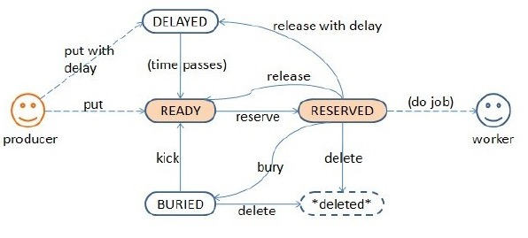

# beanstalkd 源码学习笔记

## 代码目录结构

```
.
├── Contributing
├── LICENSE
├── Makefile
├── README
├── adm ( 做成系统服务相关配置 )
├── ct （测试用例代码）
├── doc （文档）
├── pkg （文档）
```

## 重要代码

- tube
- heap
- job
用两个数据结构描述job。（1）jobrec，job的描述信息，元数据；（2）job，job内容的实际存储

```
struct job {
    Jobrec r; // persistent fields; these get written to the wal //描述job的属性，持久化时这些数据会写到文件中。

    /* bookeeping fields; these are in-memory only */
    char pad[6];
    tube tube;   // 指针，指向一个tube
    job prev, next; /* linked list of jobs */
    job ht_next; /* Next job in a hash table list */
    size_t heap_index; /* where is this job in its current heap */
    File *file;
    job  fnext;
    job  fprev;
    void *reserver;
    int walresv;
    int walused;

    char body[]; // written separately to the wal
};
```

- ms
自定义的集合类型，在此项目中用来管理连接、tube。
- all_jobs_init
哈希表，存储job,按照job id取模来进行哈希。该哈希表用于快速查找job。


# job状态迁移



# 参考文档

- http://blog.csdn.net/sunnycoco05/article/details/52104617
- http://kr.github.io/beanstalkd/
- http://in355hz.iteye.com/blog/1395727
- http://www.bytedancer.net/archives/21
- http://www.fzb.me/2015-3-21-beanstalkd-protocol-chinese-version.html

